<div align="center">


<h3>Solutions globales en ingénierie</h3>

<p>
  Official website of <strong>Engineering Studio</strong>, a multidisciplinary building-engineering
  firm based in Sétif, Algeria. It covers MEP/CET, VRD, topography and BIM.
</p>

<p>
  <a href="https://engineering-studio.net/"><strong>engineering-studio.net</strong></a>
</p>

<p>
  
  
  
  
  
  
</p>

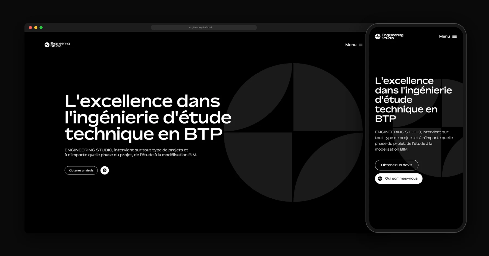

</div>

---

## About

Engineering Studio produces turnkey technical studies for construction projects. They work at every
phase, from the first study through to the full BIM model. The firm is organised into four
specialised studios:

| Studio | Scope |
| --- | --- |
| **MEP Studio** | HVAC, ventilation, air-conditioning, smoke extraction, plumbing, drainage, power & low-current systems, fire protection, medical fluids, thermal studies |
| **VRD Studio** | Roads and utility networks, earthworks, urban infrastructure, stability studies, public works, water and environment |
| **TOPO Studio** | Topographic surveys and site plans for development, construction and renovation |
| **BIM Studio** | 3D modelling and BIM synthesis of architecture, structure and every technical trade |

The website presents the firm and its services, portfolio, clients and news. It also turns visitors
into leads through a guided **quote request (Devis)**, a **meeting request (Réunion)** and a
**contact form**. Behind the public site is a **private admin dashboard** where the firm publishes
its own articles and projects and handles incoming requests, without touching code.

## Design concept

The whole identity comes from **one shape**: a circle cut into four quadrants, which is the Engineering
Studio mark. Each quadrant stands for one of the four studios, and the site uses that idea as its
structure:

- **The mark is the navigation.** On the *Prestations* page, the four quadrants are the four
  studios. Each one is a large tile that leads to its own studio page, and each studio has its own
  lockup cut from the same shape.
- **Monochrome, technical, calm.** The site is black and white only, set in the geometric *Bossa*
  typeface. Photography appears as **line-art technical drawings in circular frames**, which read
  like engineering plans rather than stock images.
- **Motion with purpose.** An intro sequence opens the site, pages change through a branded
  transition, and sections rise into place as they are scrolled to. All motion
  turns off automatically for users who prefer reduced motion.
- **Pixel-exact to the design.** Every desktop page is built in the original 1920 px Figma
  coordinates. The root font-size is tied to the viewport width, so the layout matches the design
  exactly at 1920 px and scales proportionally at every other desktop width. Below 1024 px, a
  purpose-built mobile layout takes over instead of a squeezed desktop page.

## Screenshots

### Desktop

<table>
  <tr>
    <td width="50%">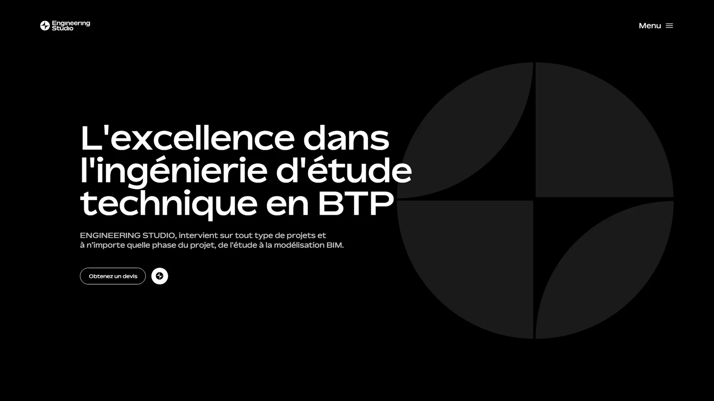<p align="center"><sub>Home</sub></p></td>
    <td width="50%">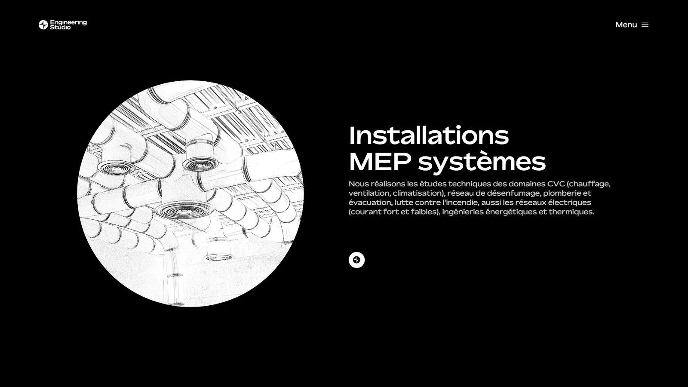<p align="center"><sub>Services</sub></p></td>
  </tr>
  <tr>
    <td>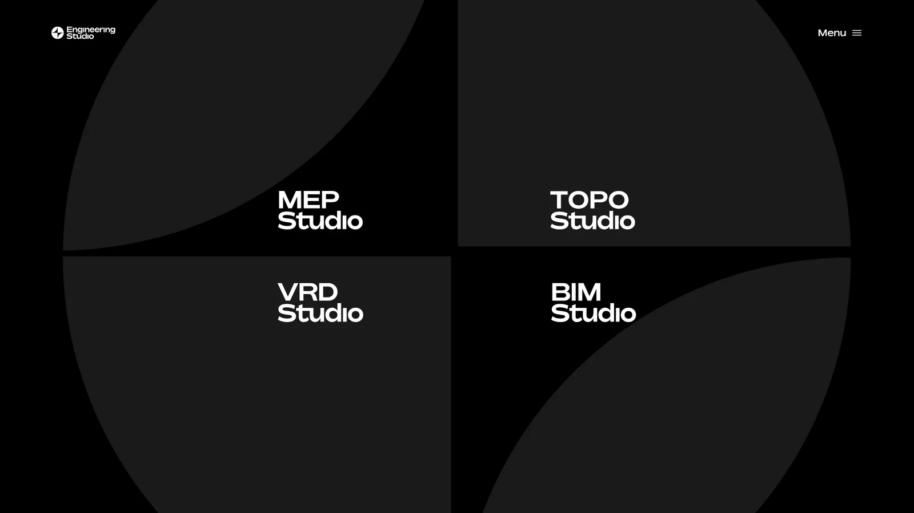<p align="center"><sub>Prestations: the four studios</sub></p></td>
    <td>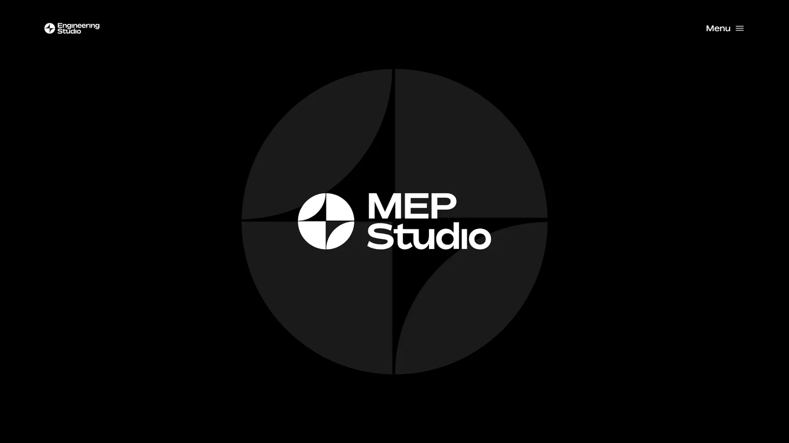<p align="center"><sub>MEP Studio</sub></p></td>
  </tr>
  <tr>
    <td>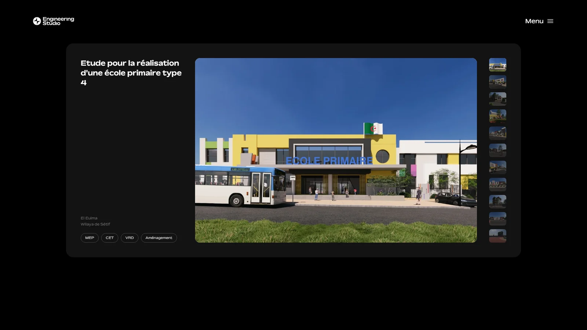<p align="center"><sub>Portefeuille (portfolio)</sub></p></td>
    <td>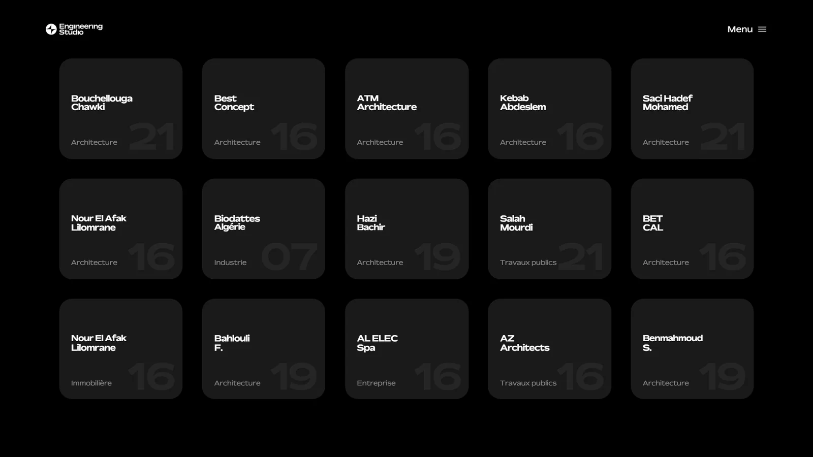<p align="center"><sub>Clients</sub></p></td>
  </tr>
  <tr>
    <td>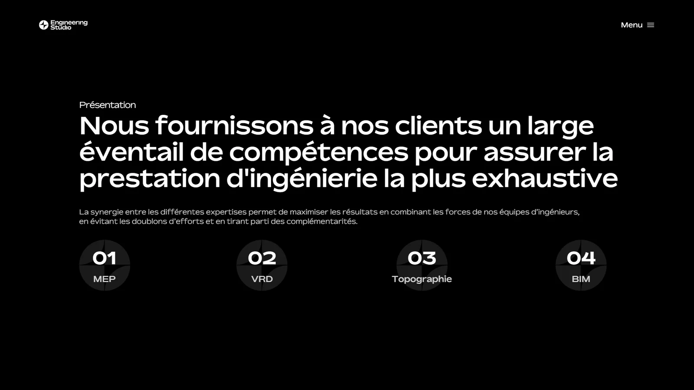<p align="center"><sub>À propos</sub></p></td>
    <td>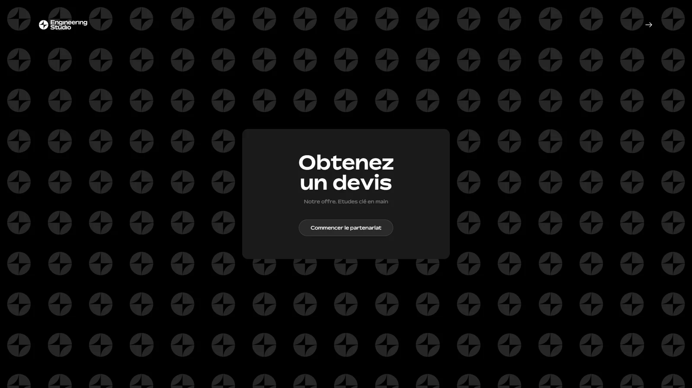<p align="center"><sub>Quote request (Devis)</sub></p></td>
  </tr>
  <tr>
    <td>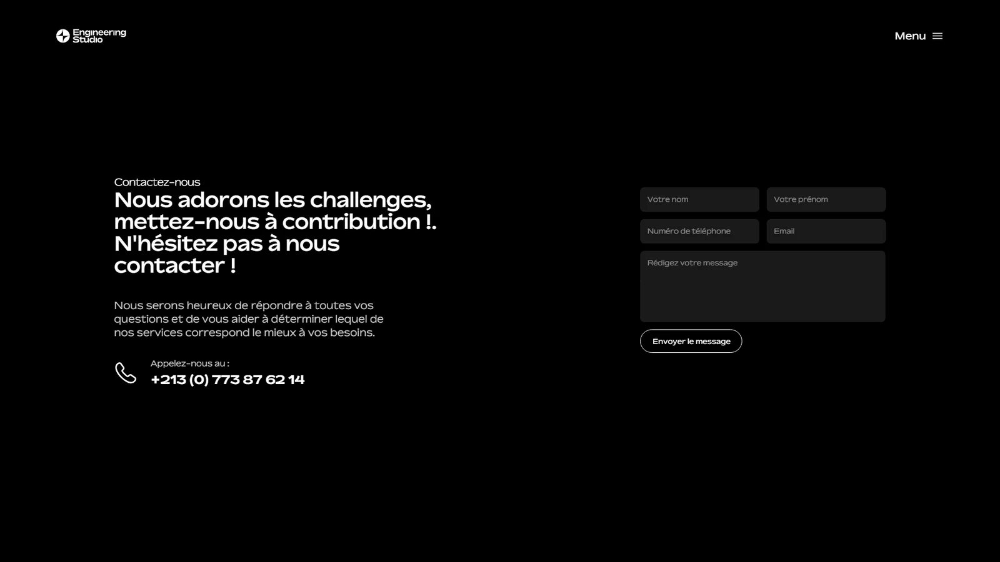<p align="center"><sub>Contact</sub></p></td>
    <td>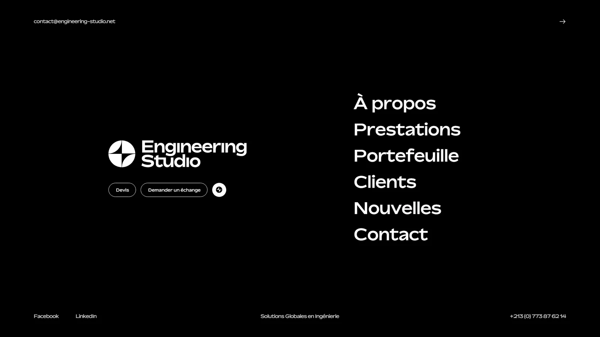<p align="center"><sub>Menu</sub></p></td>
  </tr>
</table>

### Mobile

<table>
  <tr>
    <td width="25%">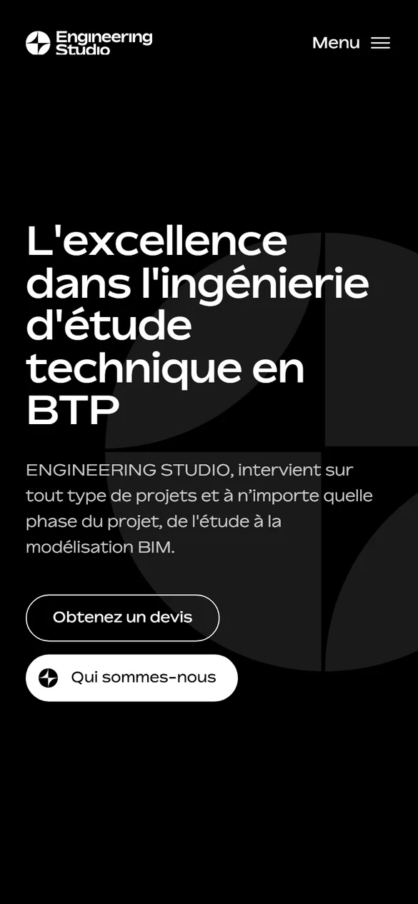<p align="center"><sub>Home</sub></p></td>
    <td width="25%">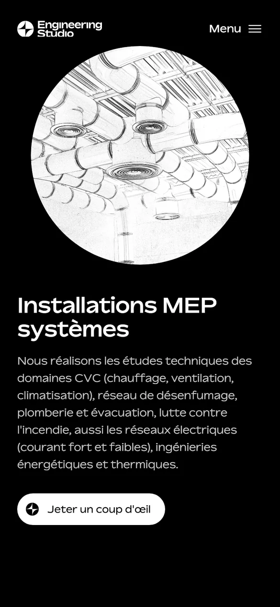<p align="center"><sub>Services</sub></p></td>
    <td width="25%">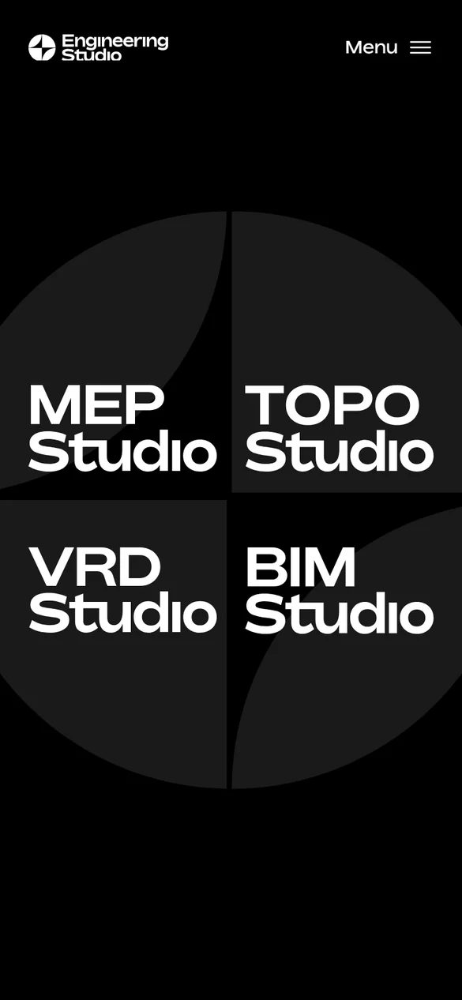<p align="center"><sub>Prestations</sub></p></td>
    <td width="25%">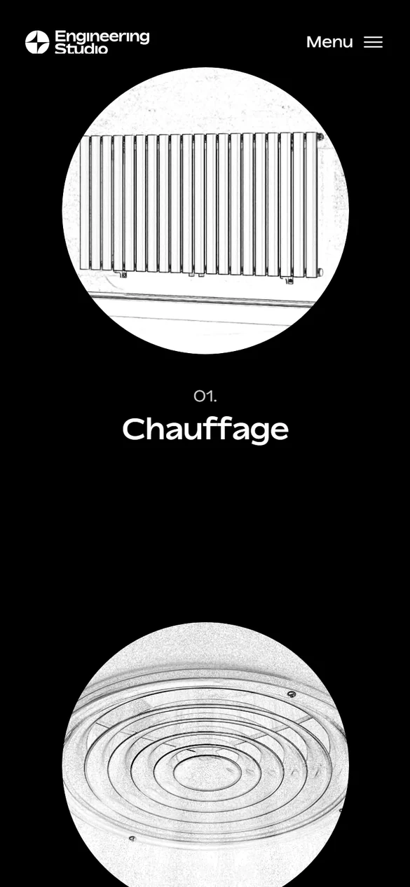<p align="center"><sub>MEP Studio</sub></p></td>
  </tr>
  <tr>
    <td>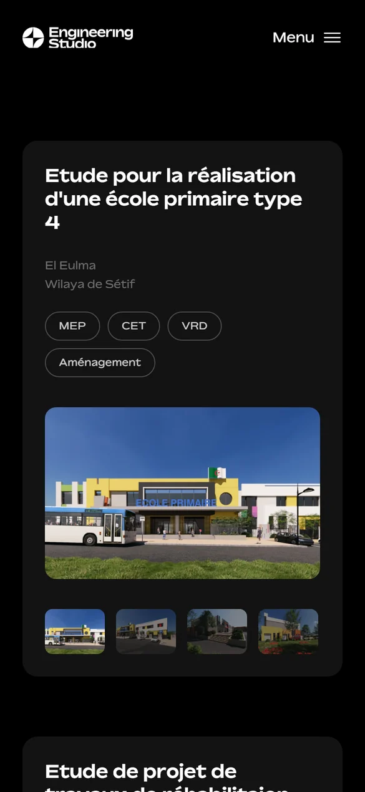<p align="center"><sub>Portefeuille</sub></p></td>
    <td>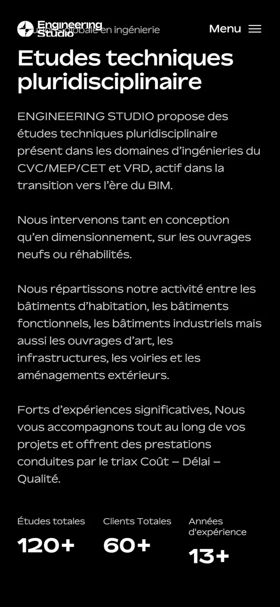<p align="center"><sub>À propos</sub></p></td>
    <td>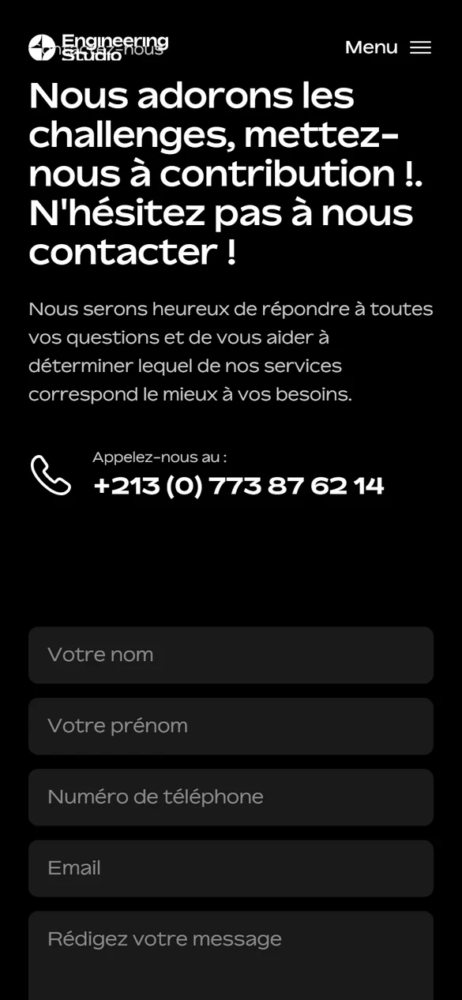<p align="center"><sub>Contact</sub></p></td>
    <td>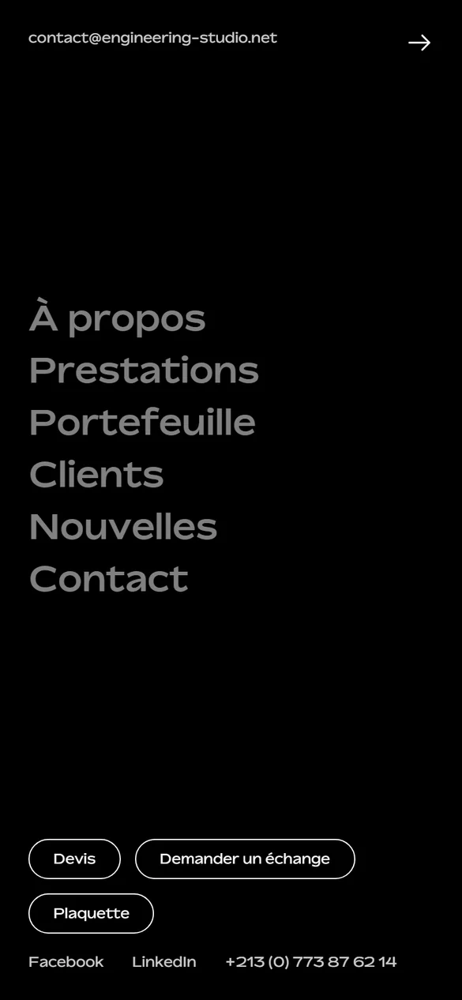<p align="center"><sub>Menu</sub></p></td>
  </tr>
</table>

## Features

**Public website**

- Home, À propos, Prestations, four studio pages (MEP, VRD, TOPO, BIM), Portefeuille, Clients,
  Nouvelles (news and article pages) and Contact
- A multi-step **quote request** where visitors can attach plans, plus a **meeting request** flow
  and a **contact form**
- A portfolio of projects with image galleries and video, and news articles, both managed from the
  dashboard
- Downloadable company brochure, intro sequence, animated menu and page transitions

**Admin dashboard** (`/admin`)

- Secure sign-in restricted to an allow-list of administrators
- Create, edit and publish **news articles** and **portfolio projects**
- Image uploads compressed to WebP in the browser before upload, and chunked video uploads of up
  to 3 GB with a progress bar
- One inbox for every **quote, meeting and contact request**, with read status, private file
  attachments and **CSV export**

## Tech stack

| Layer | Technology |
| --- | --- |
| Framework | **React 18** · **TypeScript** (strict) · **Vite 5** |
| Routing | React Router 6, with every route lazy-loaded |
| Styling | **Tailwind CSS 3** plus a custom design-coordinate layout system |
| Animation | Framer Motion 11 |
| Backend | **Supabase**: PostgreSQL with Row-Level Security, Auth, Storage |
| Media | Supabase Storage for images (resized on the fly), a PHP 8 chunked-upload endpoint for video |
| Tooling | pnpm · Biome (lint + format) · headless-Chrome visual QA scripts |
| CI/CD | GitHub Actions: type-check, lint, build, then deploy over FTPS |
| Hosting | Apache / LiteSpeed at [engineering-studio.net](https://engineering-studio.net/) |

## Performance

- **Code splitting:** every page and the entire admin dashboard are lazy-loaded chunks, so
  visitors only download the page they are on.
- **Responsive images:** database images are served through the Supabase render endpoint with a
  `srcset`, lazy-loaded by default, and compressed to **WebP** before upload.
- **Video on demand:** video uses `preload="none"` with a poster image, so no bytes are spent
  until a visitor presses play.
- **Aggressive caching:** content-hashed bundles are cached for a year as `immutable`, artwork is
  cached for a week with `stale-while-revalidate`, and HTML always revalidates so deploys show up
  immediately.
- **Compression:** Brotli, with gzip as a fallback, for all text assets and fonts.
- **Lean runtime:** self-hosted fonts, no third-party scripts, trackers or UI kits, and a
  preconnect to the API origin.

## SEO

- **Per-route metadata:** a `useSeo` hook sets the title, description, canonical URL, Open Graph
  and Twitter tags on every page and article.
- **Crawler-ready HTML:** static default tags in `index.html` for social crawlers that do not run
  JavaScript, plus a 1200×630 Open Graph image.
- **Structured data:** JSON-LD `ProfessionalService` schema with the business name, area served,
  address and contact details.
- **Sitemap and robots:** `sitemap.xml` is regenerated on every build, including each published
  article, and `robots.txt` points to it.
- **One canonical host:** `www` and `http` are 301-redirected to `https://engineering-studio.net`.
- **Semantic, accessible markup:** French language tagging, descriptive `alt` text, ARIA labels
  and clean deep links for every route.

## Security

- **HTTP hardening:** a strict **Content-Security-Policy** (`script-src 'self'`, no inline
  scripts, `object-src 'none'`, `frame-ancestors 'self'`), plus HSTS with preload, `nosniff`,
  `X-Frame-Options`, a strict `Referrer-Policy` and a locked-down `Permissions-Policy`.
- **Row-Level Security everywhere:** visitors can only *read* published content and *insert* form
  submissions. Every write, read of submissions and storage change requires an authenticated user
  on the `admins` allow-list, checked in the database through `is_admin()`.
- **Server-side abuse limits:** a Postgres trigger rate-limits submissions per email and globally,
  and `CHECK` constraints cap every field's size. These limits apply no matter how the API is
  called.
- **Spam protection without captchas:** a honeypot field, a minimum fill time and a per-browser
  throttle.
- **Private attachments:** plans attached to a quote go into a **private bucket**, readable only
  by admins through signed URLs.
- **Safe media uploads:** the video endpoint verifies the caller's Supabase session *and* admin
  role, checks the file's actual type from its contents (`video/*` only), and stores it under a
  random file name.
- **Safe exports:** CSV export neutralises spreadsheet formula injection.
- **Secrets hygiene:** only the public anon key ships to the browser. The `service_role` key is
  never used client-side, and `.env` files are git-ignored.

## Project structure

```
├── public/                 Static assets, fonts, .htaccess (headers, caching, SPA routing)
├── src/
│   ├── pages/              Public pages, studio pages, mobile layouts and admin screens
│   ├── components/         Site chrome, intro, menu, transitions, media and form guards
│   ├── design/             Figma-coordinate layout system, root scaling and motion helpers
│   ├── lib/                Supabase data layer, validation, SEO hook, image and upload pipeline
│   ├── context/            Auth, menu and page-transition state
│   ├── config/             Site constants and feature flags
│   └── data/               Static content (clients, about, navigation)
├── supabase/               Database schema, RLS policies, triggers and storage buckets
├── octenium/               Admin-only chunked video upload endpoint (PHP)
├── scripts/                Build-time sitemap and OG-image generation
├── tools/                  Headless-Chrome visual QA and end-to-end admin checks
└── .github/workflows/      CI: type-check, lint, build, deploy
```

## Development

Requires Node 20+ and pnpm.

```sh
pnpm install
cp .env.example .env      # add the Supabase URL and anon key
pnpm dev                  # http://localhost:5173
pnpm build                # type-check + production build to dist/
pnpm lint                 # Biome
```

Every push to `main` is type-checked, linted, built and deployed automatically by GitHub Actions.

## Credits

Built for **Engineering Studio** by **[Alaa Younsi](https://github.com/Alaa-Younsi)**: front-end, back-end,
database, admin dashboard, infrastructure and deployment.

## License

**Copyright © 2026 Alaa Younsi. All rights reserved.**

This is proprietary software. No part of this project, including its source code, design,
structure or assets, may be copied, reused, modified, distributed or used to build another
product without prior written permission. The Engineering Studio name, logos, imagery and content
belong to Engineering Studio. See [LICENSE](LICENSE) for the full terms.
